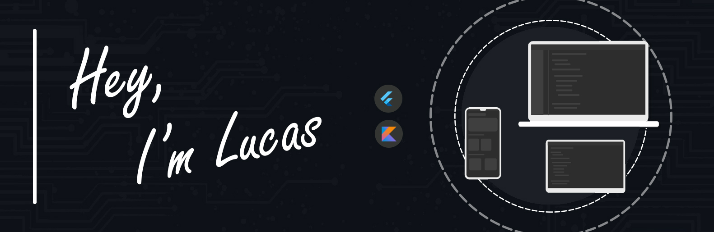

<!--  -->

<!-- https://user-images.githubusercontent.com/76869974/127777072-197eefdb-6185-41ef-ab6f-4cc759e9f37b.jpg -->

<h1 align="center">
  
  
  
</h1>

 
 

About me:

- I’m currently working on... 🤔
 
- I’m currently learning about <b>Mobile</b> with <b>Flutter/Dart</b> + <b>Kotlin</b> & <b>Swift</b>

- I’m looking to collaborate on <b>everything i can</b>

- I ❤️ 🦉

> ❝For in dreams we enter a world that is entirely our own. Let them swim in the deepest ocean or glide over the highest cloud.❞

<h3 align="left">Where to find me <small>(@LucJosin)</small>:</h3>

 
 
 
 
 
 

<h3 align="left">Website | Contact:</h3>
 
 

<h3 align="left">Languages, Tools & Stats:</h3>

 
 
 
 
 
 
 
 

